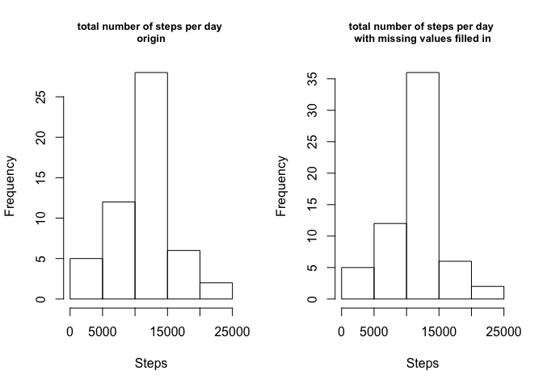

## Loading and preprocessing the data


```r
# set the working directory
setwd("~/Documents/Coursera/R/5reproducible research/project1")
# load the data
activity <- read.csv("activity.csv",stringsAsFactors = F)
```

## What is mean total number of steps taken per day?

1. Calculate the total number of steps taken per day

```r
steps.per.day <- with(activity,tapply(steps,date,sum))
```

2. Make a histogram of the total number of steps taken each day

```r
hist(steps.per.day,xlab="Steps",main="total number of steps taken each day")
```

<!-- -->

3. Calculate and report the mean and median of the total number of steps taken per day

```r
mean(steps.per.day,na.rm=T)
```

```
## [1] 10766.19
```

```r
median(steps.per.day,na.rm=T)
```

```
## [1] 10765
```


## What is the average daily activity pattern?

1. Make a time series plot (i.e. 𝚝𝚢𝚙𝚎 = "𝚕") of the 5-minute interval (x-axis) and the average number of steps taken, averaged across all days (y-axis)

```r
library(dplyr)
```

```
## 
## Attaching package: 'dplyr'
```

```
## The following objects are masked from 'package:stats':
## 
##     filter, lag
```

```
## The following objects are masked from 'package:base':
## 
##     intersect, setdiff, setequal, union
```

```r
# compute average steps of each interval
steps.interval <- group_by(activity,interval) %>% summarise(average.steps=mean(steps,na.rm=T))

plot(steps.interval$interval,steps.interval$average.steps,type="l",xlab="interval",ylab="average steps",main="average daily activity pattern")
```

<!-- -->

2. Which 5-minute interval, on average across all the days in the dataset, contains the maximum number of steps?

```r
steps.interval[which.max(steps.interval$average.steps),]$interval
```

```
## [1] 835
```

## Imputing missing values

1. Calculate and report the total number of missing values in the dataset (i.e. the total number of rows with 𝙽𝙰s)


```r
sum(is.na(activity$steps))
```

```
## [1] 2304
```

2. Devise a strategy for filling in all of the missing values in the dataset. The strategy does not need to be sophisticated. For example, you could use the mean/median for that day, or the mean for that 5-minute interval, etc.

3. Create a new dataset that is equal to the original dataset but with the missing data filled in.


```r
# create a logical vector which indicates the missing values in activity
indx <- is.na(activity$steps)
# compute average steps of each interval without missing values
mean.per.interval <- with(activity,tapply(steps,interval,mean,na.rm=T))
# make a copy of activity
activity.copy <- activity
# fill in missing values in activity.copy with average steps per interval without missing values
activity.copy$steps[indx] <- mean.per.interval[as.character(activity$interval[indx])]
# check first six rows in activity.copy
head(activity.copy)
```

```
##       steps       date interval
## 1 1.7169811 2012-10-01        0
## 2 0.3396226 2012-10-01        5
## 3 0.1320755 2012-10-01       10
## 4 0.1509434 2012-10-01       15
## 5 0.0754717 2012-10-01       20
## 6 2.0943396 2012-10-01       25
```

```r
# check if missing values are filled in
sum(is.na(activity.copy$steps))
```

```
## [1] 0
```

4. Make a histogram of the total number of steps taken each day and Calculate and report the mean and median total number of steps taken per day. Do these values differ from the estimates from the first part of the assignment? What is the impact of imputing missing data on the estimates of the total daily number of steps?


```r
# compute total number of steps per day with missing value filled in
total.per.day <- with(activity.copy,tapply(steps,date,sum))
# make a plot 
par(mfrow=c(1,2))
hist(steps.per.day,xlab="Steps",main="total number of steps per day \norigin",cex.main=0.8)
hist(total.per.day,xlab="Steps",main="total number of steps per day \nwith missing values filled in",cex.main=0.8)
```

<!-- -->

## Are there differences in activity patterns between weekdays and weekends?

1. Create a new factor variable in the dataset with two levels – “weekday” and “weekend” indicating whether a given date is a weekday or weekend day.


```r
activity.copy <- mutate(activity.copy,date=as.Date(date,"%Y-%m-%d"))%>%mutate(weekday.or.weekend=ifelse(weekdays(date)=="Saturday"|weekdays(date)=="Sunday","weekend","weekday"))
```

```
## Warning in strptime(x, format, tz = "GMT"): unknown timezone 'zone/tz/
## 2017c.1.0/zoneinfo/America/New_York'
```

```r
# check dataset with the new variable
head(activity.copy)
```

```
##       steps       date interval weekday.or.weekend
## 1 1.7169811 2012-10-01        0            weekday
## 2 0.3396226 2012-10-01        5            weekday
## 3 0.1320755 2012-10-01       10            weekday
## 4 0.1509434 2012-10-01       15            weekday
## 5 0.0754717 2012-10-01       20            weekday
## 6 2.0943396 2012-10-01       25            weekday
```

2. Make a panel plot containing a time series plot (i.e. 𝚝𝚢𝚙𝚎 = "𝚕") of the 5-minute interval (x-axis) and the average number of steps taken, averaged across all weekday days or weekend days (y-axis). 


```r
# compute average steps for each interval for weekday and weekend
mean.activity.week.interval <- group_by(activity.copy,weekday.or.weekend,interval)%>%summarise(average.steps=mean(steps))
# make the plot
library(lattice)
xyplot(average.steps~interval|as.factor(weekday.or.weekend),data=mean.activity.week.interval,layout=c(1,2),type="l",ylab="number of steps")
```

<!-- -->
